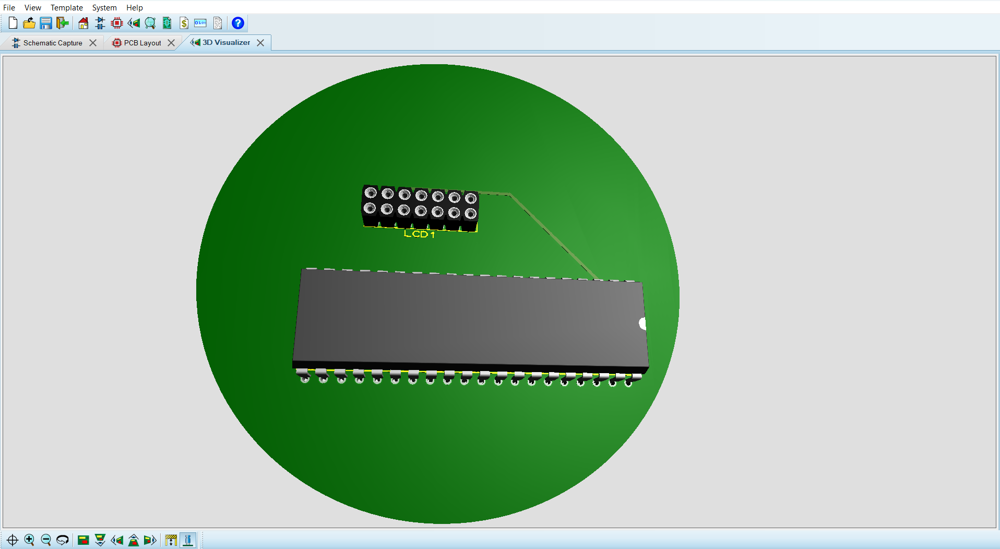
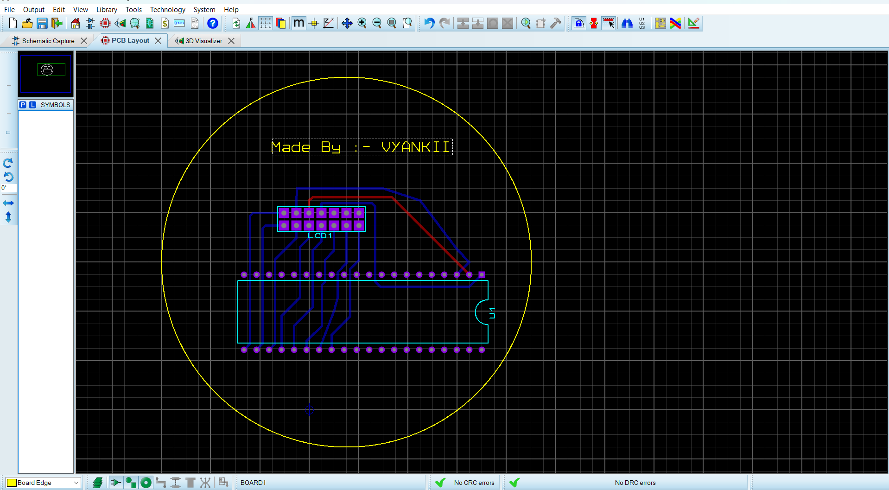

# LCD Display Project with 8051 Microcontroller

This project demonstrates how to interface an LCD display with an 8051 microcontroller to display the name "VYANKATESH<<<". The code is written in Embedded C, and the project includes Proteus simulations, PCB design, and a 3D view.

## Project Overview
  This project uses:

  - 8051 Microcontroller to control the LCD.
  - 16x2 LCD Display to display text.
  - Proteus for schematic and PCB layout design.
  - Embedded C for programming the microcontroller.

### Features

  - Initializes and configures the LCD display.
  - Displays the text "VYANKATESH<<<" on the first line of the LCD.
  - Utilizes basic commands to control the cursor, display clear, and character display.

### Files Included

  - LCD_Display_Project.c - The main C code file for the project.
  - Proteus_Schematic.pdsprj - Proteus schematic file for the circuit design.
  - PCB_Layout.pcb - PCB layout for the project.
  - 3D_View.png - 3D rendering of the PCB design.

### Circuit Schematic
The schematic is designed using Proteus, with the following pin connections:

  - P2 (Port 2): Data lines for LCD.
  - P1.0: RS (Register Select) pin of the LCD.
  - P1.1: RW (Read/Write) pin of the LCD.
  - P1.2: EN (Enable) pin of the LCD.

### Pin Configuration
LCD Pin    	Microcontroller Pin
RS	        P1.0
RW	        P1.1
EN	        P1.2
D0-D7      	P2.0 - P2.7

### Setup Instructions
  - 1) Clone the repository.
  - 2) Open the Proteus schematic file (Proteus_Schematic.pdsprj) in Proteus.
  - 3) Load the C code into the 8051 microcontroller in Proteus.
  - 4) Run the simulation to see the output on the LCD.

### Code Explanation

  - lcdcmd(): Sends a command to the LCD.
  - lcddat(): Sends data (characters) to the LCD for display.
  - delay(): Introduces delay for LCD commands and data to execute.

### Sample Code Snippet

#include<reg51.h>
sbit rs=P1^0;
sbit rw=P1^1;
sbit en=P1^2;
void lcdcmd(unsigned char); // Command function
void lcddat(unsigned char); // Data function
void delay();               // Delay function

void main() {
    // Initialization code
    ...
}

### Proteus Simulation

The Proteus simulation file provides an accurate emulation of the circuit, where you can observe the LCD displaying the name.

### PCB Layout and 3D View
  - The PCB layout file (PCB_Layout.pcb) is designed to match the schematic.
  - A 3D view (3D_View.png) shows the physical layout of the components.
  
  
 
### How to Use
  - Modify the code if you want to display different text on the LCD.
  - Adjust delay values in the delay() function if necessary, depending on the clock frequency.
